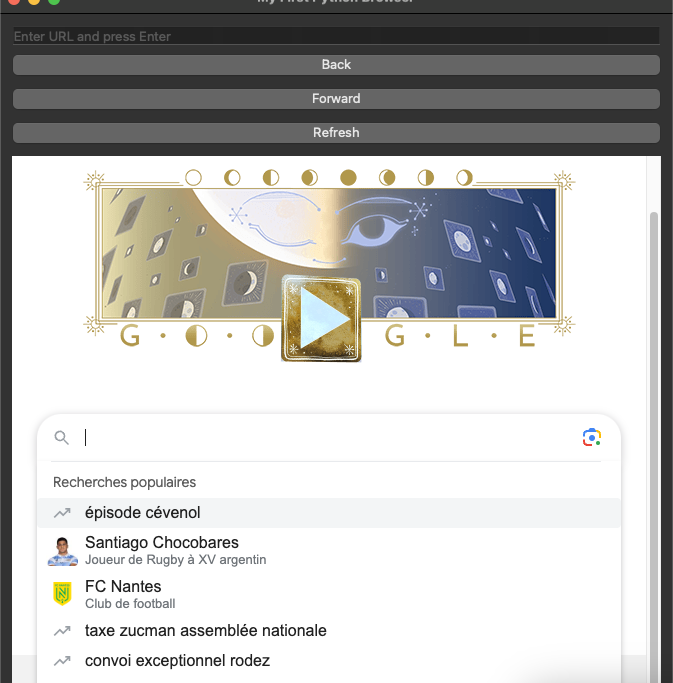
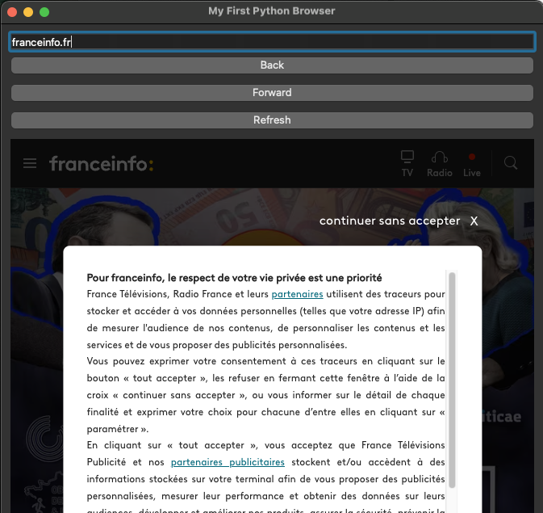
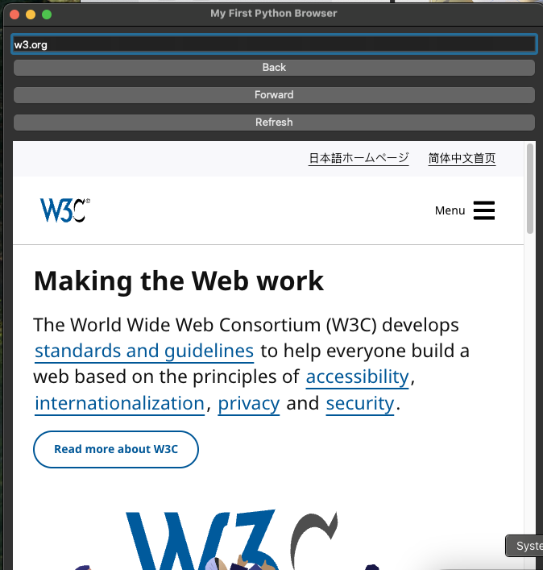

<!DOCTYPE html>
<html lang="en">
<head>
    <meta charset="UTF-8">
    <meta name="viewport" content="width=device-width, initial-scale=1.0">
    <title>MyBrowser</title>
    
</head>
<body>
    <h1>MyBrowser</h1>
    
MyBrowser is a simple, fast, and minimal web browser built for efficiency. Designed with a clean UI and essential browsing features, it offers a lightweight alternative to mainstream browsers.

    <h1>Simple Python Browser</h1>
    
A basic web browser built with Python and PyQt6, featuring a URL bar and basic navigation controls.

    <h2>Features</h2>
    <ul>
        <li>URL input bar with Enter key support</li>
        <li>Navigation buttons (Back, Forward, Refresh)</li>
        <li>Web page rendering using QWebEngineView</li>
        <li>Default homepage set to Google</li>
        <li>Automatic HTTP prefix addition for URLs</li>
    </ul>

    <h2>Requirements</h2>
    <ul>
        <li>Python 3.x</li>
        <li>PyQt6 library</li>
    </ul>

    <h2>Installation</h2>
    <ol>
        <li>Install Python 3.x if not already installed</li>
        <li>Install PyQt6 using pip:
            <pre><code>pip install PyQt6 PyQt6-WebEngine</code></pre>
        </li>
    </ol>

    <h2>Usage</h2>
    <ol>
        <li>Clone or download this repository</li>
        <li>Navigate to the project directory</li>
        <li>Run the browser:
            <pre><code>python simple_browser.py</code></pre>
        </li>
        <li>Enter a URL in the text field and press Enter to navigate</li>
        <li>Use the navigation buttons to:
            <ul>
                <li>Go Back to previous page</li>
                <li>Go Forward to next page</li>
                <li>Refresh current page</li>
            </ul>
        </li>
    </ol>

    <h2>Code Structure</h2>
    <pre><code>simple_browser.py
├── SimpleBrowser class
│   ├── __init__ - Initializes window and widgets
│   └── load_url - Handles URL loading
└── Main execution block</code></pre>

    <h2>Dependencies</h2>
    <ul>
        <li>PyQt6.QtWidgets - GUI components</li>
        <li>PyQt6.QtWebEngineWidgets - Web browsing functionality</li>
        <li>PyQt6.QtCore - URL handling</li>
    </ul>

    <h2>Screenshots</h2>
    

        
        
        
    

    <ul>
        <li>The browser window is created using QMainWindow</li>
        <li>Web content is rendered with QWebEngineView</li>
        <li>Navigation controls are implemented with QPushButton</li>
        <li>URL input uses QLineEdit with Enter key detection</li>
        <li>Layout is managed with QVBoxLayout</li>
    </ul>

    <h2>Limitations</h2>
    <ul>
        <li>No bookmark functionality</li>
        <li>No tab support</li>
        <li>Basic error handling</li>
        <li>No history view</li>
    </ul>

    <h2>Contributing</h2>
    
Feel free to fork this repository and submit pull requests with improvements!

</body>
</html>